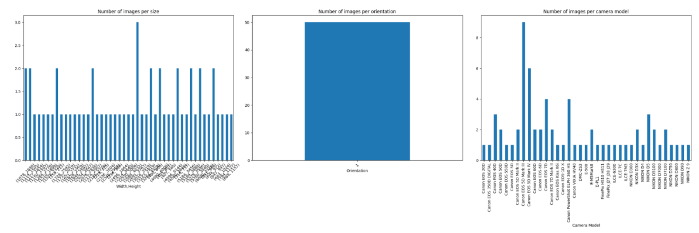
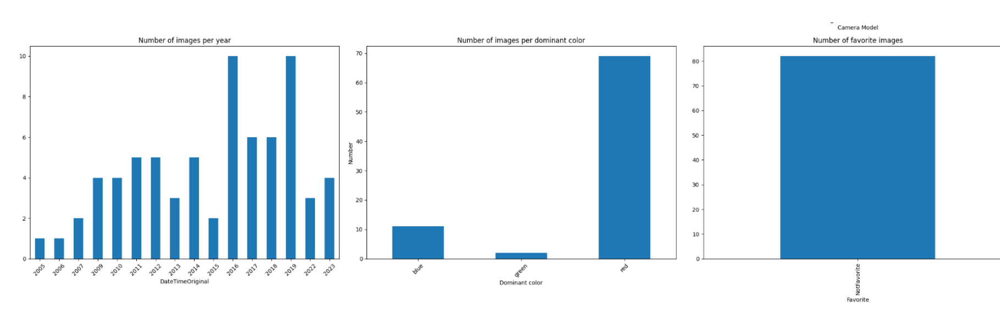
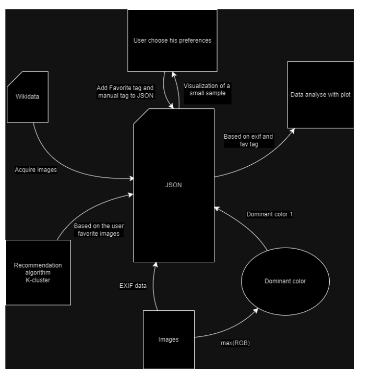

# Actor vendor, recommendation  system  
25\.03.2024 

Eléa Machillot CPE Lyon - 4IRC 

## Introduction

### Our goal 

Our primary objective is to develop a recommendation system using Python, focusing on the users’ favorite images.  Specifically, we concentrate on images of currently living actors. 

We choose to have distinct programs to achieve this. 

Firstly, we initiate the data collect. It retrieves information about actors from Wikidata, download their images, extract EXIF data and dominant color from these images. All gathered information is then stored in a JSON file. 

Secondly, we implement a grid layout to display images, checkboxes, and text input fields. It is designed to display only the first 20 downloaded images and allows users to mark images as favorites and add tag to them. Upon clicking the “Select” button, the selected images’ favorite status and tag are updated in JSON files.

Furthermore, the user can visualize extracted data including image sizes, orientations, camera models and dominant colors.

Finally, we load our images metadata from our JSON file. It identifies a favorite image, performs K-means clustering to group similar images. Leveraging these clusters, the system generates recommendations for similar items based on the user's favorite image. 

### Source 

All the images we use originate from Wikimedia Commons, which serves as the primary source of our image data. While these images may have been contributed from diverse origins, they are housed within the Wikimedia Commons database. We access and utilize them directly from this repository for our purposes.

All structured data within Wikidata's main, Property, Lexeme, and EntitySchema namespaces is licensed under Creative Commons CC0, effectively placing it in the public domain. Contributors can designate public domain data as CC0. Wikidata does not accept any other licensing arrangements beyond CC0 for its data

### Images 

We made the decision to collect as much Exif data as possible for each image in our database. Additionally, we manually add a few tags, such as designating images as favorites, determining the dominant color of each image, and adding relevant tags for categorization purposes. 

Through the grid display, user can choose is favorite color, which trigger the Favorite tag. We do not stock any other information. 

## Preferences

Our recommendation system leverages EXIF data and dominant colors. EXIF data consists of metadata captured automatically when a picture is taken, including details such as orientation, camera model, software used, and more

## Exploration model and Machine Learning

### What we use 

IIn this project, we employ Clustering Algorithms, which are algorithms designed to group a set of objects in a manner where objects within the same group (cluster) exhibit greater similarity to each other than to those in other groups. We cluster data based on various features such as orientation, camera model, manual tags, dominant colors, and more.

### Obtained metric 

We conducted testing on a dataset consisting of a hundred actor pictures, and here are the metric results we obtained: 

**Silhouette Score:** 0.5673807460855643 

**Adjusted Rand Index:** 0.004682072194532548 

**Homogeneity:** 0.41951059531406115 

**Completeness:** 0.013119521996817034 

**V-measure:** 0.02544334415426628 

The high Silhouette Score suggests well-defined and separated clusters. However, the Adjusted Rand Index indicates some discrepancy between actual and predicted clusters. While Homogeneity and Completeness scores are not particularly high, they still provide insights into the clustering process.

## Diagrams and visualization

Plot for hundred of images, based on exif data and dominant color :

Diagram of the programs :  

## Our opinion

Self-assessment

|**Data collect** |- Automated approaches to data collection||+++ |
| - | - | :- | - |
|Labeling and annotation|- Use of freely licensed images|||
||- Storage and management of images and |||
||associated metadata|||
||- Automated Approaches to Labeling||+ |
||- Storing and managing image labels and annotations |||
||- Using classification and clustering algorithms|||
|Data Analytics |- Types of analyzes used||+++ |
||- Using Pandas, Scikit-learn and Mining Algorithms |||
|Data visualization |- Types of visualization techniques used||+++ |
||- Using matplotlib |||
|Recommendation system |- Storing and managing user preferences and profile||+ |
||- Using Recommendation Algorithms|||
|Tests |- Presence of functional test and user tests ||- + |
|Report |
- Clarity of presentation 

- Presence of a clear introduction and conclusion, 
||+++ |
||architecture of the diagrams, a summary of the |||
||different tasks carried out and the limits|||
||- Bibliography |||

I'd like to mention that the course was quite different from the practical sessions, so we felt a bit lost initially. We were left to figure out the recommendation algorithm quite on our own, it would have been helpful to have a dedicated class on it.

` `However, it was incredibly interesting, and it introduced us to the world of data mining.

## Bibliography 

- Wikidata Query Service Documentation
- Python Official Documentation 
- Matplotlib Documentation 
- Pandas Documentation
- Scikit-learn Documentation

## Conclusion 

Our project was to develop a recommendation system based on image data analysis. Despite ![ref2]further possible refinements, our system shows promise for delivering personalized recommendation. 
C:\Users\memac\Downloads\Machillot_Perrono.md